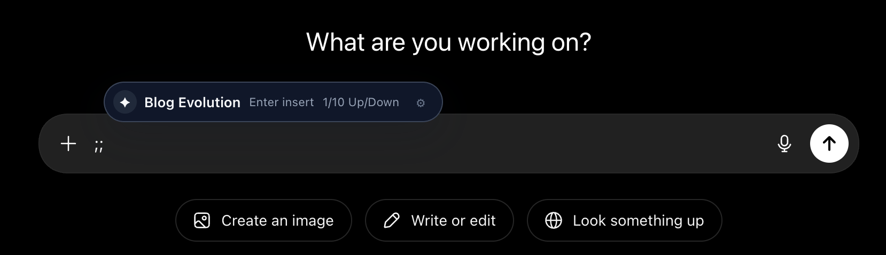
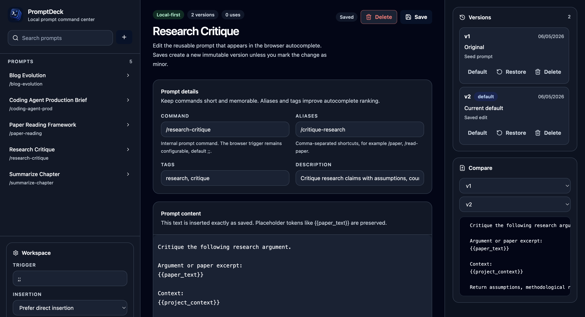

# PromptDeck

[](https://chromewebstore.google.com/detail/promptdeck/ibhheacppbbekiihiabfmplinfopcind)
[](https://github.com/orkunkinay/promptdeck)
[](LICENSE)

PromptDeck is a local-first prompt command center for storing reusable AI prompts and making them available where people work.

PromptDeck now ships across four surfaces that all share one prompt model and the same backup format:

1. **Browser extension** — a Chrome/Manifest V3 extension with a `;;` autocomplete helper and a manager UI.
2. **Terminal CLI** — search, print, and copy prompts from the command line, with JSON output for scripts and coding agents.
3. **VS Code extension** — search, insert, and copy prompts through the Command Palette and Quick Pick.
4. **Native desktop / clipboard** — copy a resolved prompt to the system clipboard from the CLI, ready to paste into any native app (ChatGPT Desktop, Claude Desktop, editors, etc.).

The browser extension keeps its library in the browser profile (IndexedDB). The CLI and VS Code extension share a local-first JSON file store (default `~/.promptdeck/library.json`). Backups bridge the two: a browser backup can seed the file store, and the file store can export a browser-compatible backup. No account, cloud, telemetry, or backend is involved on any surface.

For a visual documentation page, open [index.html](index.html) directly in a browser.

## See PromptDeck In Action

PromptDeck is designed to stay out of the way while making reusable prompts quickly available.

<div align="center">
  <video src="https://github.com/user-attachments/assets/f2f0d833-297b-497a-a983-c37cc8d44055" controls width="100%" muted>
    Your browser does not support embedded video.
  </video>
</div>

### Lightweight Command Helper

Type the trigger, search the local prompt library, and insert the selected prompt directly into the active composer when the site allows direct insertion.

<p align="center">
  
</p>

### Local-First Prompt Manager

Create, organize, version, and back up reusable prompts from a focused dashboard.

<p align="center">
  
</p>

## What It Does

- Saves a local prompt library with titles, commands, aliases, tags, descriptions, and usage stats.
- Opens an autocomplete helper when the user types the configured trigger, default `;;`.
- Searches prompts by command, alias, title, tags, description, recency, usage, and host-specific use.
- Inserts prompts into textareas, text inputs, and contenteditable editors, with clipboard fallback.
- Supports prompt versions, restore, default version selection, deletion, and line-based diff comparison.
- Supports variants that can be selected with suffixes such as `;;paper:short`.
- Detects `{{placeholder}}` tokens and stores placeholder metadata.
- Exports JSON backups, previews imports, handles conflicts, and exports individual prompts as Markdown.
- Currently ships as a Manifest V3 browser extension with minimal permissions: `storage` and `clipboardWrite`.

PromptDeck is not a prompt marketplace, prompt generator, cloud account system, analytics product, or chat-history reader.

## Install From Source

Requirements:

- Node.js 20 or compatible modern Node runtime
- npm
- Chrome or another Chromium browser that can load unpacked Manifest V3 extensions

```bash
git clone https://github.com/orkunkinay/promptdeck.git
cd promptdeck
npm install
npm run build
```

Then load the extension:

1. Open `chrome://extensions`.
2. Enable **Developer mode**.
3. Click **Load unpacked**.
4. Select the generated `dist/` folder.
5. Open a normal web page with a text field and type `;;`.

After rebuilding, reload the extension in `chrome://extensions` and refresh any open page where you want the content script to run.

## Basic Usage

Open the manager with the browser action popup, the extension options page, or the keyboard shortcut:

- macOS: `Command+K`
- Windows/Linux: `Ctrl+K`

Create or edit a prompt in the manager. Commands are stored with a leading slash, for example `/paper-reading`, but the browser trigger is separate. With the default trigger, type `;;paper` in an editable field to search for matching prompts.

Common insertion shortcuts while the helper is open:

- `Enter`: insert the selected prompt, or copy it when the insertion mode is set to clipboard.
- `Tab`: insert the selected prompt.
- `ArrowUp` / `ArrowDown`: move through results.
- `Ctrl+ArrowDown` or `Command+ArrowDown`: expand the result menu.
- `Ctrl+Enter` or `Command+Enter`: copy the selected prompt.
- `Shift+Enter`: preserve the typed command and append the prompt.
- `Escape`: close the helper.
- `Ctrl+E` or `Command+E`: open the manager.

Variants and versions can be addressed with suffixes. For example, `;;paper:short` resolves a variant named or suffixed `short`; `;;paper:v2` resolves version `v2`. If no suffix matches, PromptDeck uses the prompt's default version.

## Terminal CLI

The CLI reads and writes a local JSON library at `~/.promptdeck/library.json`
(override with `PROMPTDECK_LIBRARY` for an explicit file or `PROMPTDECK_HOME`
for a data directory; `XDG_DATA_HOME` and `%APPDATA%` are also respected). The
file is created and seeded with example prompts on first use. Search reuses the
same fuzzy ranking as the browser, and variant/version suffixes resolve the same
way (`paper:short`, `paper:v2`).

Build and link the CLI:

```bash
npm install
npm run build:cli        # bundles bin/promptdeck.mjs
npm link                 # exposes the `promptdeck` command (or: node bin/promptdeck.mjs ...)
```

During development you can also run it without building via `npm run cli -- <args>`.

Commands:

```bash
promptdeck list
promptdeck search <query>
promptdeck show <command-or-id>[:variant-or-version]
promptdeck copy <command-or-id>[:variant-or-version]
promptdeck print <command-or-id>[:variant-or-version]
promptdeck import <backup.json> [--mode merge-safe|merge-update|replace]
promptdeck export [output.json]        # "-" or no path writes to stdout
promptdeck pick                        # interactive terminal search + copy
promptdeck doctor
```

Examples:

```bash
promptdeck search refactor --json
promptdeck print /paper-reading:short
promptdeck copy /commit-message
promptdeck export - > backup.json

# Fill {{placeholders}} when printing or copying:
promptdeck print /paper-reading:short --var paper_text="$(cat paper.txt)"
promptdeck print /paper-reading --vars vars.json --strict
```

- `--json` gives machine-readable output for `list`, `search`, `show`, and `doctor`.
- `print` writes raw prompt content to stdout for pipes and coding agents.
- `--var name=value` (repeatable) and `--vars <file.json>` fill `{{placeholder}}`
  tokens for `print` and `copy`. Without them, content is emitted verbatim with
  placeholders intact. `--strict` exits non-zero if a required placeholder is
  left unfilled.
- The local library file is written atomically and with private `0600`
  permissions, since it contains your prompt text.
- `copy` writes to the system clipboard (`pbcopy` on macOS, `clip` on Windows,
  `wl-copy`/`xclip`/`xsel` on Linux) and falls back with a clear message when no
  clipboard tool is available.
- `doctor` reports the storage path, prompt count, schema version, and clipboard
  availability.
- Exit codes: `0` success, `1` usage/error, `2` not found, `3` clipboard unavailable.

## VS Code Extension

The VS Code extension lives in [`extensions/vscode`](extensions/vscode) and uses
the same shared core and local file store as the CLI.

```bash
npm install              # repo root, once
cd extensions/vscode
npm run build            # bundles dist/extension.js with esbuild
```

Open the `extensions/vscode` folder in VS Code and press `F5` to launch an
Extension Development Host. To package a `.vsix`, run `npm install` inside
`extensions/vscode`, then `npm run build` and `npx @vscode/vsce package`. See
[extensions/vscode/README.md](extensions/vscode/README.md) for details.

Commands (Command Palette):

- **PromptDeck: Search Prompt** — search, then Insert / Copy / Show.
- **PromptDeck: Insert Prompt** — insert at the cursor or replace the selection.
- **PromptDeck: Copy Prompt** — copy resolved content to the clipboard.
- **PromptDeck: Import Backup** / **Export Backup** — bridge with PromptDeck backups.
- **PromptDeck: Open Library File** — open `library.json`.

The Quick Pick lists each prompt plus every addressable variant and non-default
version. Override the library path per-workspace with the `promptdeck.libraryPath`
setting.

## Coding Agents And Automation

The CLI is the machine-readable surface for editors and coding agents:

- `--json` for `search`/`list`/`show` returns structured records.
- `print` and `copy` are non-interactive and pipe-friendly.
- Commands avoid prompts unless you explicitly run the interactive `pick`.
- Stable exit codes and `stderr` messages suit scripting.

```bash
promptdeck search refactor --json | jq '.[0].command'
promptdeck print /coding-agent-prod:prod | pbcopy
```

## Native Desktop / Clipboard Access

For native apps (ChatGPT Desktop, Claude Desktop, other editors), copy a prompt
to the clipboard and paste it:

```bash
promptdeck copy /paper-reading:short      # then paste anywhere
promptdeck pick                           # interactive search, copies on select
```

Bind these to a global shortcut or launcher for system-wide access, for example:

- **macOS**: an Automator "Quick Action" or a Raycast/Alfred script command running `promptdeck pick`.
- **Linux**: a desktop keybinding that runs `promptdeck pick` in a terminal, or `promptdeck copy <command>`.
- **Windows**: a shortcut or AutoHotkey binding that runs `promptdeck copy <command>`.

## Using One Library Across Surfaces

The browser and the CLI/VS Code surfaces use separate stores by design (browser
IndexedDB vs. a local JSON file), but the same backup format bridges them:

```bash
# Seed the file store from a browser backup (exported from the manager UI)
promptdeck import ~/Downloads/promptdeck-backup-2026-01-01.json --mode merge-update

# Export the file store as a browser-compatible backup to import back in the manager
promptdeck export promptdeck-from-cli.json
```

The CLI and VS Code extension already share the same `~/.promptdeck/library.json`,
so a prompt copied in the terminal and one inserted in VS Code come from the same
place.

## Data And Privacy

PromptDeck is local-first:

- Prompt library data is stored in IndexedDB through Dexie.
- Settings are stored in `chrome.storage.local`.
- Prompt content does not leave the browser unless the user inserts it into a site, copies it, exports a backup, imports a selected file, or enables a future sync provider if one is implemented.
- No account, analytics, telemetry, backend, tracking scripts, or remote hosted JavaScript are included.

JSON backup files contain prompt text and settings. Treat exported backups like private documents.

See [PRIVACY.md](PRIVACY.md) and [SECURITY.md](SECURITY.md) for the longer policy notes.

## Development

Install dependencies once:

```bash
npm install
```

Useful scripts:

```bash
npm run dev              # Start Vite for UI development
npm run typecheck        # Run TypeScript checks
npm run lint             # Alias for the typecheck gate
npm test                 # Run Vitest unit tests
npm run test:e2e         # Run Playwright extension smoke tests; requires dist/
npm run build            # Build the unpacked extension into dist/
npm run build:debug      # Build dist/ with sourcemaps and readable output
npm run build:cli        # Bundle the terminal CLI into bin/promptdeck.mjs
npm run cli -- <args>    # Run the CLI from source without building
npm run package:chrome   # Build and zip the Chrome extension package
npm run validate:package # Validate an existing dist/ package policy
```

The CLI and VS Code core live under `src/core` (the platform-neutral file store
and library) and reuse the same `src/shared` logic as the browser extension, so
unit tests for all surfaces run under the same `npm test`.

For realistic extension testing, prefer `npm run build` and load `dist/` as an unpacked extension. The Vite dev server is useful for UI work, but content scripts and service worker behavior are closest to production through the built extension.

The Playwright smoke tests expect `dist/manifest.json`, so run `npm run build` before `npm run test:e2e`.

## Project Structure

```text
src/
  background/              Manifest V3 service worker and runtime message handling
  content/                 Trigger detection, helper UI, editor insertion, clipboard fallback
  options/                 React prompt manager, settings, backups, versions, variants
  popup/                   Browser action popup
  cli/                     Terminal CLI entrypoint, argument parsing, command runner
  core/                    Platform-neutral file store, library façade, token resolution, clipboard
  shared/
    backup/                Backup schema, validation, preview, conflict handling, import plans
    importExport/          JSON and Markdown import/export helpers
    models/                Prompt, version, variant, settings, and runtime message types
    promptCompiler/        Placeholder extraction and compile helpers
    search/                Local prompt ranking
    settings/              Default settings and chrome.storage service
    storage/               Dexie database, prompt repository, migrations, seed data
    sync/                  Future sync boundary
    versioning/            Version, variant, restore, diff, and resolution logic
  tests/                   Vitest coverage for core behavior
tests/e2e/                 Playwright extension smoke tests
extensions/vscode/         VS Code extension (commands, Quick Pick, esbuild bundle)
scripts/                   Chrome package validation, zip creation, CLI bundling
public/                    Icons, logo, screenshots, and demo media copied into builds
```

## Architecture Notes

PromptDeck uses a Manifest V3 service worker as the trusted runtime boundary. Content scripts and the options UI communicate through typed runtime messages that are validated in `src/background/index.ts` before storage operations run.

The content script watches only active editable context needed for command detection. It parses commands with the configured trigger, searches the local prompt list, displays a shadow-DOM helper, and resolves selected prompts through the versioning service before insertion.

Insertion is adapter based. The generic path covers text inputs, textareas, and contenteditable fields. Rich-editor adapters cover common editor families such as ProseMirror, Lexical, Slate/Draft, and CodeMirror where generic contenteditable handling needs help. If direct insertion cannot be verified, PromptDeck copies the prompt and tells the user to paste.

Backups use `kind: "promptdeck.backup"` and schema version `1`. Import preview supports:

- `merge-safe`: add new prompts and skip conflicts.
- `merge-update`: add new prompts and replace conflicting local prompts with backup data.
- `replace`: replace all local prompts and settings with the backup after confirmation.

Before applying an import, the manager saves a pre-import snapshot in local storage under `promptdeck:last-pre-import-backup`.

## Packaging And Release Checks

`npm run package:chrome` runs the build, validates `dist/`, removes development-only package artifacts, and creates `promptdeck-chrome-extension.zip`.

The packaging script enforces:

- Manifest V3.
- Exact permissions: `storage` and `clipboardWrite`.
- No host permissions, optional permissions, `activeTab`, `tabs`, or `scripting`.
- No remote script URLs in package text files.
- Required extension files such as `manifest.json`, background/content bundles, options and popup HTML, logo, and icons.

## Troubleshooting

### The helper does not open

- Confirm the trigger in the manager; the default is `;;`.
- Refresh the page after installing or reloading the extension.
- Chrome pages such as `chrome://extensions` do not allow normal content scripts.
- Confirm the current host is not disabled in settings.
- Use a normal textarea, input, or contenteditable field for testing.

### A prompt copies instead of inserting

Some editors block or rewrite synthetic insertion. PromptDeck falls back to clipboard when direct insertion is unreliable. Use the manager's insertion setting to choose **Prefer direct insertion**, **Always copy**, or **Ask every time**.

### Data is missing after browser changes

PromptDeck data is tied to the browser profile and local extension storage. Data can be lost if the browser profile is removed, extension data is cleared, the extension is uninstalled with local data, or a different browser profile is used. Export JSON backups before risky browser cleanup or reinstall work.

### A command or alias will not save

PromptDeck prevents command collisions across commands and aliases. Choose a unique command or alias if the manager reports a collision.

## Contributing

Read [CONTRIBUTING.md](CONTRIBUTING.md) before opening a pull request. Changes that touch storage, backup parsing, import/export, prompt versioning, permissions, or content-script insertion should include tests and explain compatibility or privacy impact.

See [ROADMAP.md](ROADMAP.md) for planned areas of work and manual QA notes.

## License

PromptDeck is released under the MIT License. See [LICENSE](LICENSE).
